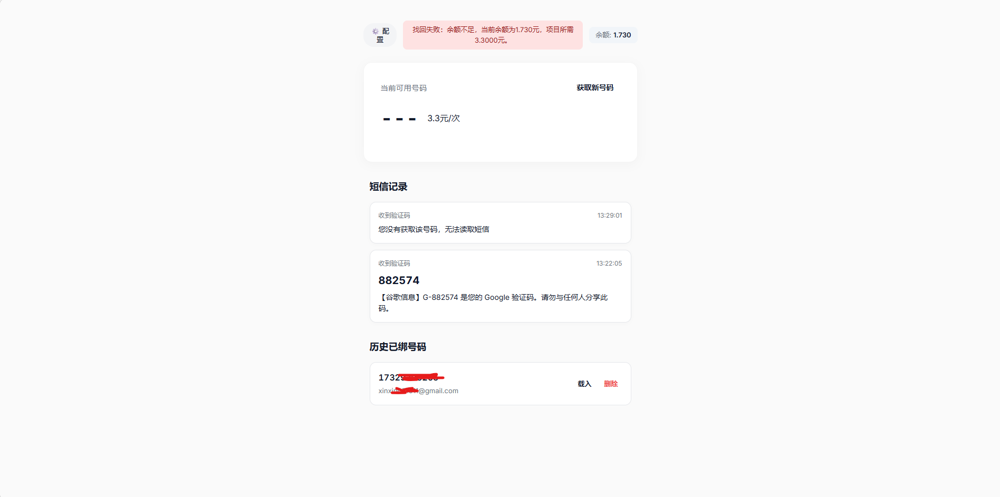
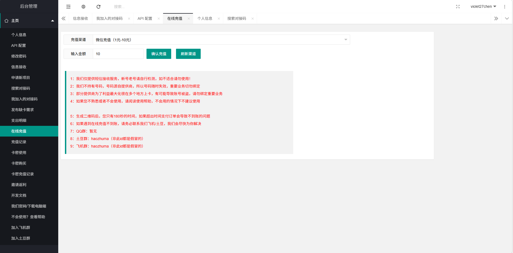
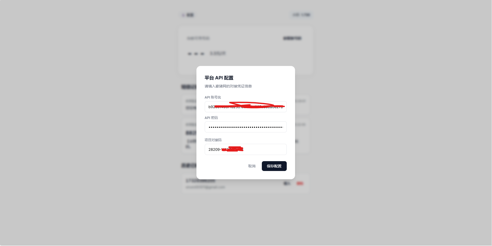

# 谷歌邮箱注册专用接码助手 快速指南

欢迎使用本工具。本工具专为辅助注册谷歌账号而设计，对接了「豪猪网」的短信接收平台，可快速获取真实的国内移动手机号并提取谷歌短信验证码。

## 1. 注册与充值

首先，你需要拥有一个豪猪网账号并确保内有余额。

> **💡 为什么选择 3.3元的单价？**
> 平台上可能存在几毛钱甚至更便宜的线路，但经过测试，**3.3元/次的高级线路收码成功率最高、最稳定**。为了不浪费时间在低价死号上反复重试，本工具已默认对接了最稳定的高级通道。

👉 **[点击前往充值中心进行充值 (h5.haozhuma.com)](https://h5.haozhuma.com/index.php)**

## 2. 获取 API 凭证

为了让本工具能够自动调用你的额度获取号码，我们需要配置 API 交互凭证。你需要在豪猪网的用户中心找到这些信息。

## 3. 在工具中进行配置

初次打开 `index.html` 时，系统会自动弹出**平台 API 配置**窗口（你也可以随时点击左上角的“⚙️ 配置”修改）：

1. **API 账号名**：填入你在豪猪网获取的由一串英文字符组成的 API 用户名（并非你的登录名）。
2. **API 密码**：填入对应的 API 通讯密码密钥。
3. **项目对接码**：系统已内置对接码 `28209-YJI2QSFH3R`，如果你有新的可用业务码，可在此处覆盖填入。

---

## 4. 开始使用

配置成功后，页面右上角将显示你当前可用的余额。

1. 点击 **[获取新号码]**，系统将消耗你的计费并发请求，并返回一个国内移动号码。
2. 请在弹窗中**填写你正在注册的谷歌邮箱名（前缀即可）**，方便以后回溯是谁用了哪个号码。
3. 去谷歌注册页面填入该号码。
4. 回到本工具等待，通常在 5 ~ 30 秒内会自动出现验证码，点击该粗体验证码即可自动复制。

**说明与限制：**
* **历史短信永存**：你过去接收过的短信会一直保存在当前浏览器的记录中。
* **找回号码**：如果你曾给号码绑定过邮箱，该号码会出现在「历史已绑号码」中。点击【载入】可尝试向平台发送请求，如果该号码仍在你的有效时限内且未被系统回收，你即可重新监听该号码的后续短信。
* **全局释放**：当你获取新号码时，为了防止扣费浪费，本工具会自动向服务端发送全局释放指令，清理你后台可能遗留挂载的其余号码，确保当前只服务一个并发号码。

---

## 5. 经验与防封技巧

> **模拟器免验证码大法**
> 强烈建议使用 **MuMu 模拟器** 进行谷歌账号的注册。在模拟器环境下注册，大概率可以跳过繁琐的“发送短信验证”环节，直接进入接码流程，成功率极高。

> **刚注册就被封停怎么办？**
> 如果注册后账号立刻被提示封禁，**不要慌张，这是谷歌的常规机器风控**。
> 1. 直接点击页面的**申诉**按钮。
> 2. 在申诉理由里随便写几句话（例如：“我是真人，不是机器”）。
> 3. 通常在 **一天之内** 就能顺利解封。解封后的账号只要**保持节点环境稳定**，就可以一直稳定使用了。
